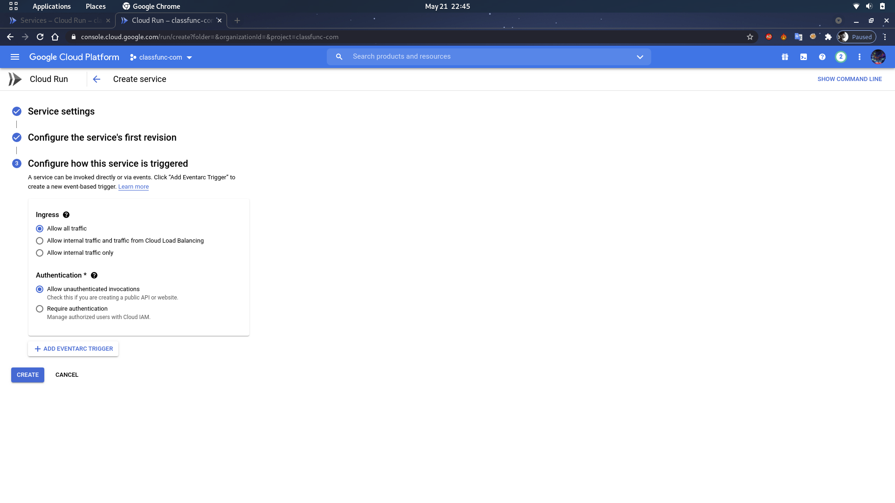

# Cloud Run

### Truy cap https://console.cloud.google.com/run
#

## Service settings
#

- Service name: Ten dich vu
- Region: chon khu vuc gan minh nhat (HongKong hoac Singapore)
- Next

## Configure the service's first revision
#

- Select container image URL: Chon container muon deploylen
- Next

## Configure how this service is triggered
#

- Chon Allow all traffic
- Authentication: Xac thuc
    + Allow unauthenticated invocation. Bo qua xac thuc.
    + Require authentication.(Can xac thuc)
- Create

## Sau khi tao xong

### Chon Edit & Deploy new revision
- 
Deploy

# CLI
Build
- gcloud builds submit --tag gcr.io/classfunc-com/tim-xe-api

Run
- gcloud run deploy --image gcr.io/classfunc-com/tim-xe-api --platform managed