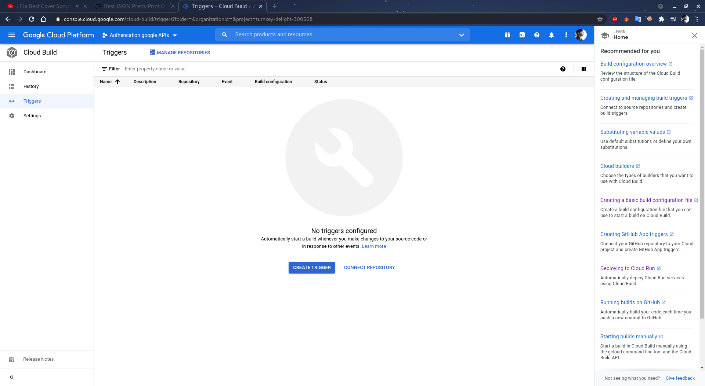
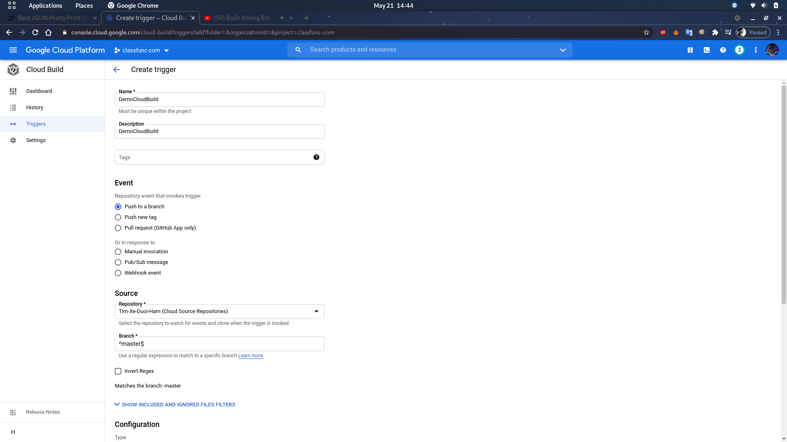
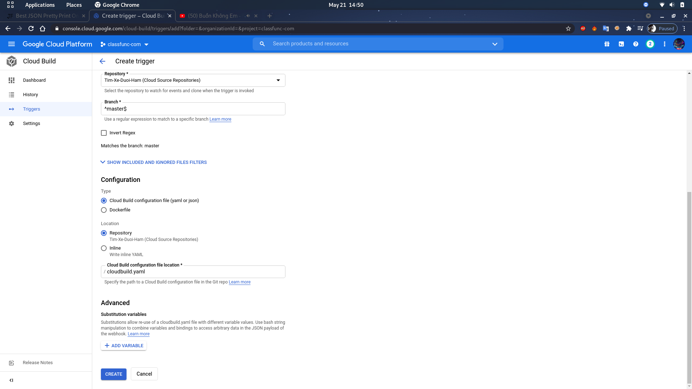
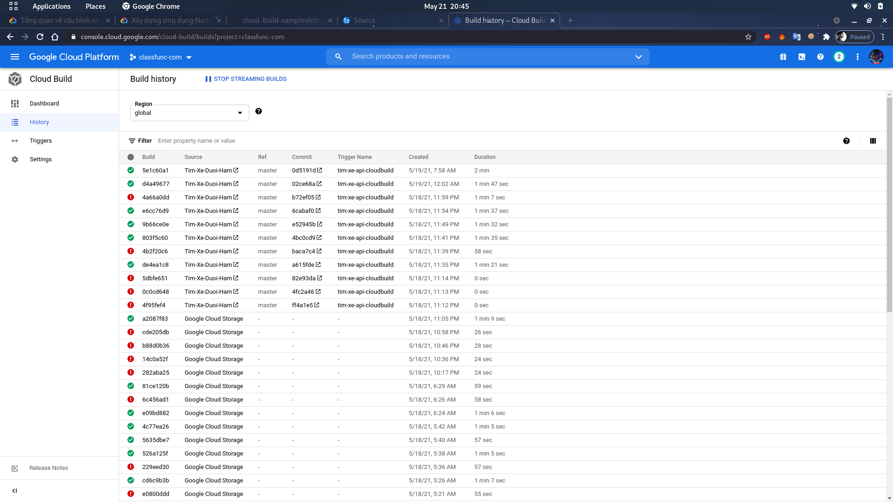
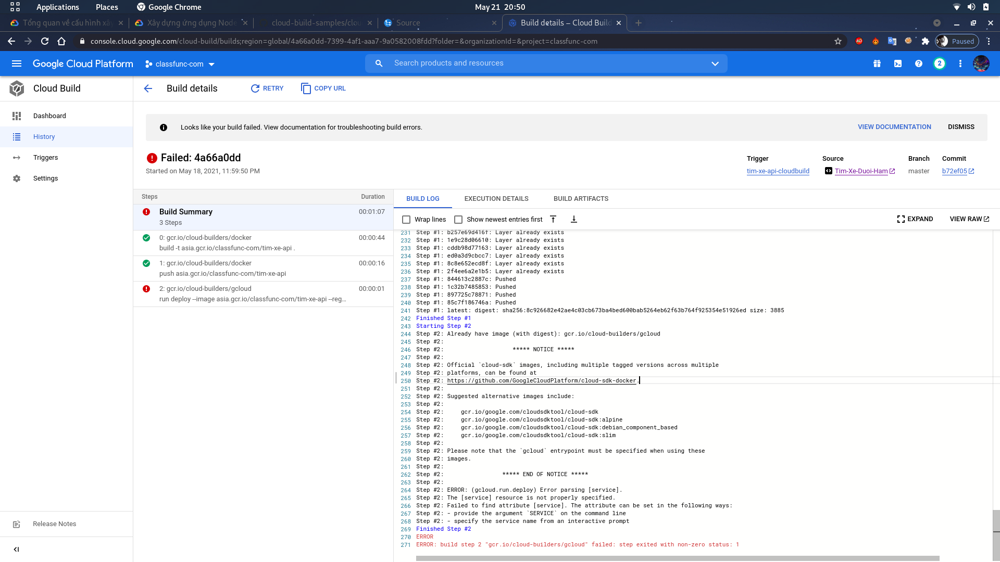
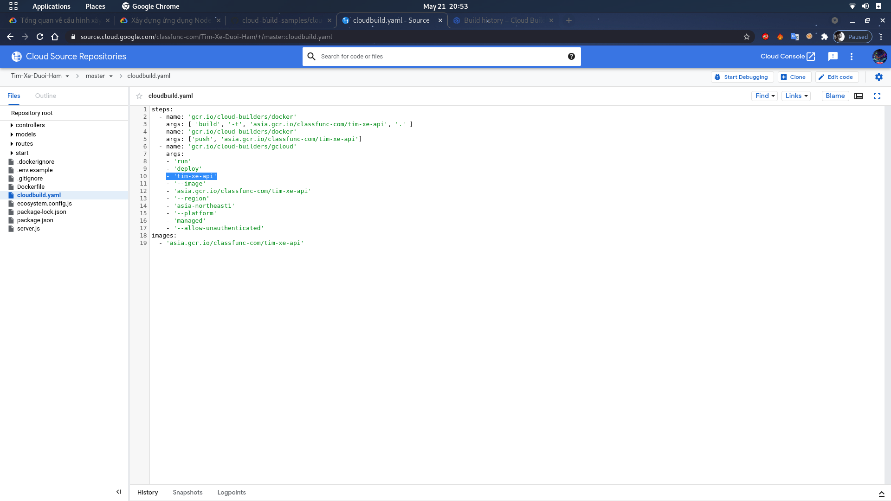
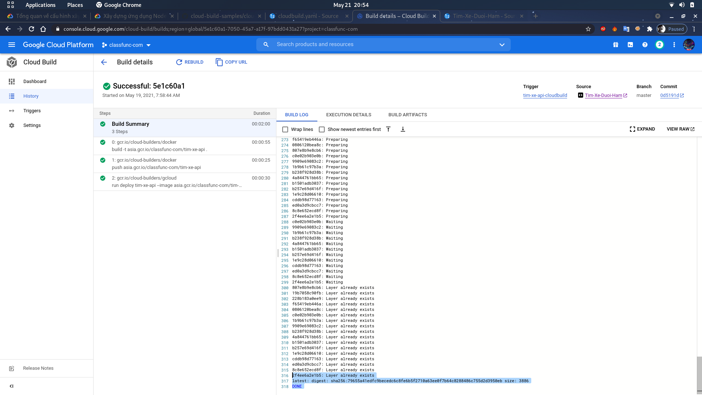

# Cloud build

- Truy cap cao Google Cloud Build
https://console.cloud.google.com/home/dashboard

- chon Triggers

- Click tringgers



- Name: Nhap ten triigers du an
- Description: Mo ta
- Event : de mac dinh la push to a branch

- Source: 
    + Repository: source code google cloud ban muon build.
    + branch: chon branch master de khi push master se duoc build lai 



- Configuration
    + Type: Cloud build configutation file (yaml or json)
    + Location: Repository
    + Clould build file location: Vi tri thu muc '/cloudbuild.yaml'

- Add varriable: tao bien sử dụng lại tệp cloudbuild.yaml
Muc dich la de bao mat nhung token hay password quan trong de trong file cloudbuild goi ra,
    + Cach goi bien ra : `${_ten_bien_}`


## Tệp cấu hình
Duoc viet bang dinh dang yaml va json

cloudbuild.yaml
```
steps:
- name: string
  args: [string, string, ...]
  env: [string, string, ...]
  dir: string
  id: string
  waitFor: [string, string, ...]
  entrypoint: string
  secretEnv: string
  volumes: object(Volume)
  timeout: string (Duration format)
- name: string
  ...
- name: string
  ...
timeout: string (Duration format)
queueTtl: string (Duration format)
logsBucket: string
options:
 env: [string, string, ...]
 secretEnv: string
 volumes: object(Volume)
 sourceProvenanceHash: enum(HashType)
 machineType: enum(MachineType)
 diskSizeGb: string (int64 format)
 substitutionOption: enum(SubstitutionOption)
 dynamicSubstitutions: boolean
 logStreamingOption: enum(LogStreamingOption)
 logging: enum(LoggingMode)
substitutions: map (key: string, value: string)
tags: [string, string, ...]
serviceAccount: string
secrets: object(Secret)
availableSecrets: object(Secrets)
artifacts: object (Artifacts)
images:
- [string, string, ...]
```


cloudbuild.json
```
{
    "steps": [
    {
        "name": "string",
        "args": [
            "string",
            "string",
            "..."
        ],
        "env": [
            "string",
            "string",
            "..."
        ],
        "dir": "string",
        "id": "string",
        "waitFor": [
            "string",
            "string",
            "..."
        ],
        "entrypoint": "string",
        "secretEnv": "string",
        "volumes": "object(Volume)",
        "timeout": "string (Duration format)"
    },
    {
        "name": "string"
        ...
    },
    {
        "name": "string"
        ...
    }
    ],
    "timeout": "string (Duration format)",
    "queueTtl": "string (Duration format)",
    "logsBucket": "string",
    "options": {
        "sourceProvenanceHash": "enum(HashType)",
        "machineType": "enum(MachineType)",
        "diskSizeGb": "string (int64 format)",
        "substitutionOption": "enum(SubstitutionOption)",
        "dynamicSubstitutions": "boolean",
        "logStreamingOption": "enum(LogStreamingOption)",
        "logging": "enum(LoggingMode)"
        "env": [
            "string",
            "string",
            "..."
        ],
        "secretEnv": "string",
        "volumes": "object(Volume)",
    },
    "substitutions": "map (key: string, value: string)",
    "tags": [
        "string",
        "string",
        "..."
    ],
    "serviceAccount": "string",
    "secrets": "object(Secret)",
    "availableSecrets": "object(Secrets)",
    "artifacts": "object(Artifacts)",
    "images": [
        "string",
        "string",
        "..."
    ]
}
```


- Cach viet file cloudbuild.yaml
Build Steps
-   Đối với mỗi bước xây dựng, Cloud Build thực thi một vùng chứa docker như một phiên bản của docker run
-   Có thể bao gồm một hoặc nhiều bước xây dựng trong tệp cấu hình của mình

```
steps:
- name: 'gcr.io/cloud-builders/bazel'
...

- name: 'gcr.io/cloud-builders/gcloud'
...

- name: 'gcr.io/cloud-builders/docker'
...
```

name: chỉ định trình tạo(bazel, gcloud và docker), là container image  chạy các công cụ phổ biến


```
steps:
- name: 'gcr.io/cloud-builders/mvn'
  args: ['install']
- name: 'gcr.io/cloud-builders/docker'
  args: ['build', '-t', 'gcr.io/my-project-id/myimage', '.']
```

args: truyen vao danh sach cac doi so thong qua truong "name"


```
steps:
- name: 'gcr.io/cloud-builders/docker'
  args: ['build', '-t', 'gcr.io/myproject/myimage', '.']
- name: 'gcr.io/cloud-builders/kubectl'
  args: ['set', 'image', 'deployment/myimage', 'frontend=gcr.io/myproject/myimage']
  env:
  - 'CLOUDSDK_COMPUTE_ZONE=us-east1-b'
  - 'CLOUDSDK_CONTAINER_CLUSTER=node-example-cluster'
```

Trường env có một danh sách các biến môi trường sẽ được sử dụng khi chạy bước này. Các biến có dạng KEY = VALUE


```
steps:
- name: 'gcr.io/cloud-builders/go'
  args: ['install', '.']
  env: ['PROJECT_ROOT=hello']
  dir: 'examples/hello_world'
```

 dir : Theo mặc định, Cloud Build sử dụng một thư mục có tên /workspacelà thư mục làm việc,Nếu bạn đặt dirtrường trong bước xây dựng, thư mục làm việc sẽ được đặt thành 
 `/workspace/<dir>`.


 ```
steps:
- name: 'ubuntu'
  args: ['sleep', '600']
  timeout: 500s
- name: 'ubuntu'
  args: ['echo', 'hello world, after 600s']
 ```

timeout: Nếu bạn không đặt trường này, bước này không có giới hạn thời gian và sẽ được phép chạy cho đến khi hoàn thành hoặc quá trình xây dựng hết thời gian.


```
steps:
# Download the binary and the data in parallel.
- name: 'gcr.io/cloud-builders/wget'
  args: ['https://example.com/binary']
- name: 'gcr.io/cloud-builders/gsutil'
  args: ['cp', 'gs://$PROJECT_ID-data/rawdata.tgz', '.']
  waitFor: ['-']  # Thuc hien ngay

```

```
steps:
- name: foo
  id: A
- name: bar
  id: B
  waitFor:
  - A
- name: baz
  id: C
  waitFor:
  - A

  #Các bước Bvà Cchạy đồng thời sau khi Ađã hoàn thành thành công
```

waitFor:  waitFor: ['-'] Se duoc thuc hien ngay hoac sau 1 id nao do duoc thuc hien


```
steps:
- name: 'gcr.io/cloud-builders/npm'
  entrypoint: 'node'
  args: ['--version']
```
entrypoint: để chỉ định một điểm nhập.


```
steps:
- name: 'gcr.io/cloud-builders/docker'
  entrypoint: 'bash'
  args: ['-c', 'docker login --username=$$USERNAME --password=$$PASSWORD']
  secretEnv: ['USERNAME', 'PASSWORD']
```
secretEnv : Danh sách các biến môi trường được mã hóa


```
steps:
- name: 'gcr.io/cloud-builders/docker'
  args: ['build', '-t', 'gcr.io/myproject/myimage', '.']
images: ['gcr.io/myproject/myimage']
```
images: Các images build cấu hình tập tin quy định cụ thể hoặc nhiều images Docker pushed boi cloud build để container Registry. Chi dinh images de build docker container.


```
steps:
- name: 'gcr.io/cloud-builders/docker'
  args: ['build', '-t', 'gcr.io/myproject/myimage', '.']
options:
    sourceProvenanceHash: ['SHA256']
```
sourceProvenanceHash: Đặt sourceProvenanceHash tùy chọn để chỉ định thuật toán băm cho sourceProvenance. Đoạn mã sau chỉ định rằng thuật toán băm là SHA256.


```
steps:
- name: 'gcr.io/cloud-builders/docker'
  args: ['build', '-t', 'gcr.io/myproject/myimage', '.']
options:
 machineType: 'E2_HIGHCPU_8'
```
machineType: Cloud Build cung cấp bốn loại máy ảo CPU cao. ai loại máy với 8 CPU và hai loại máy với 32 CPU. Thêm machineTypetùy chọn để yêu cầu máy ảo có CPU cao hơn
N1_HIGHCPU_8
N1_HIGHCPU_32
E2_HIGHCPU_8
E2_HIGHCPU_32


Đoạn mã sau yêu cầu kích thước đĩa là 200 GB:
```
steps:
- name: 'gcr.io/cloud-builders/docker'
  args: ['build', '-t', 'gcr.io/myproject/myimage', '.']
options:
 diskSizeGb: 200
```
diskSizeGb: Sử dụng diskSizeGbtùy chọn để yêu cầu kích thước đĩa tùy chỉnh cho bản dựng của bạn. Kích thước tối đa bạn có thể yêu cầu là 1000 GB.

- Kiem tra build chay thanh cong hay that bai
truy cap https://console.cloud.google.com/cloud-build/builds


Tich xanh la chay build thanh cong

Cham than bao bi loi

. Xem Log da bi loi click vao xem build da chay duoc den dau de kiem tra sua va chay lai build



Trong log thi ta thay bao loi ve phan service name vi xoa da xoa di, them lai cho service name vao params



Sau do thuc hien build lai


